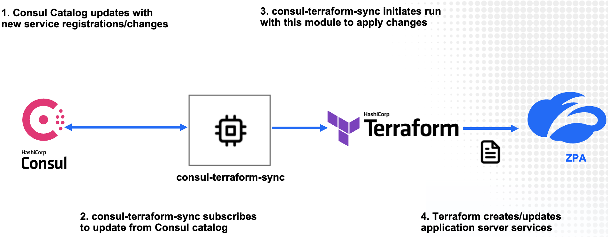

<a href="https://terraform.io">
    
</a>

<a href="https://www.zscaler.com/">
    
</a>

Zscaler Private Access (ZPA) Application Server Module for Network Infrastructure Automation
=====================================================================================================

This Terraform module allows users to support **Application Servers** by integrating [Consul Terraform Sync](https://www.consul.io/docs/nia) with Zscaler Private Access [ZPA Cloud](https://help.zscaler.com/zpa/about-servers) to dynamically manage the **address** field based on service definition in the Consul Catalog.

Using this Terraform module in conjunction with **consul-terraform-sync** enables teams to reduce manual ticketing processes and automate Day-2 operations related to application scale up/down in a way that is both declarative and repeatable across the organization and across multiple **Application Servers**.

#### Note: This Terraform module is designed to be used only with **consul-terraform-sync**

## Feature

This module supports the following:

* Create, update and delete Application Servers based on the services in the Consul catalog.

If there is a missing feature or a bug - [open an issue](https://github.com/zscaler/terraform-zpa-application-server-nia/issues)

## What is consul-terraform-sync?

The **consul-terraform-sync** runs as a daemon that enables a **publisher-subscriber** paradigm between **Consul** and **ZPA Cloud** to support **Network Infrastructure Automation (NIA)**.

<p align="left">
 </a>
</p>

* consul-terraform-sync **subscribes to updates from the Consul catalog** and executes one or more automation **"tasks"** with appropriate value of *service variables* based on those updates. **consul-terraform-sync** leverages [Terraform](https://www.terraform.io/) as the underlying automation tool and utilizes the Terraform provider ecosystem to drive relevant change to the network infrastructure.

* Each task consists of a runbook automation written as a compatible **Terraform module** using resources and data sources for the underlying network infrastructure provider.

Please refer to this [link](https://www.consul.io/docs/nia/installation/install) for getting started with **consul-terraform-sync**

<!-- BEGINNING OF PRE-COMMIT-TERRAFORM DOCS HOOK -->
## Requirements

| Name | Version |
|------|---------|
| <a name="requirement_terraform"></a> [terraform](#requirement\_terraform) | >= 0.13 |
| <a name="requirement_zpa"></a> [zpa](#requirement\_zpa) | >=2.3.2 |

## Providers

| Name | Version |
|------|---------|
| <a name="provider_zpa"></a> [zpa](#provider\_zpa) | 2.3.2 |

## Modules

No modules.

## Resources

| Name | Type |
|------|------|
| [zpa_app_connector_group.this](https://registry.terraform.io/providers/zscaler/zpa/latest/docs/resources/app_connector_group) | resource |
| [zpa_application_server.this](https://registry.terraform.io/providers/zscaler/zpa/latest/docs/resources/application_server) | resource |
| [zpa_server_group.this](https://registry.terraform.io/providers/zscaler/zpa/latest/docs/resources/server_group) | resource |
| [zpa_app_connector_group.this](https://registry.terraform.io/providers/zscaler/zpa/latest/docs/data-sources/app_connector_group) | data source |
| [zpa_server_group.this](https://registry.terraform.io/providers/zscaler/zpa/latest/docs/data-sources/server_group) | data source |

## Inputs

| Name | Description | Type | Default | Required |
|------|-------------|------|---------|:--------:|
| <a name="input_app_connector_group_city_country"></a> [app\_connector\_group\_city\_country](#input\_app\_connector\_group\_city\_country) | City of the Country where the app connector is located i.e US or CA | `string` | `"San Jose, US"` | no |
| <a name="input_app_connector_group_country_code"></a> [app\_connector\_group\_country\_code](#input\_app\_connector\_group\_country\_code) | Code of the Country where the app connector is located i.e US or CA | `string` | `"US"` | no |
| <a name="input_app_connector_group_description"></a> [app\_connector\_group\_description](#input\_app\_connector\_group\_description) | Description of the App Connector Group. | `string` | `"AppConnectorGroup"` | no |
| <a name="input_app_connector_group_dns_query_type"></a> [app\_connector\_group\_dns\_query\_type](#input\_app\_connector\_group\_dns\_query\_type) | Whether to enable IPv4 or IPv6, or both, for DNS resolution of all applications in the App Connector Group. | `string` | `"IPV4_IPV6"` | no |
| <a name="input_app_connector_group_enabled"></a> [app\_connector\_group\_enabled](#input\_app\_connector\_group\_enabled) | Whether this App Connector Group is enabled or not. | `bool` | `true` | no |
| <a name="input_app_connector_group_latitude"></a> [app\_connector\_group\_latitude](#input\_app\_connector\_group\_latitude) | Latitude of the App Connector Group. | `string` | `"37.3382082"` | no |
| <a name="input_app_connector_group_location"></a> [app\_connector\_group\_location](#input\_app\_connector\_group\_location) | Location of the App Connector Group. | `string` | `"San Jose, CA, USA"` | no |
| <a name="input_app_connector_group_longitude"></a> [app\_connector\_group\_longitude](#input\_app\_connector\_group\_longitude) | Longitude of the App Connector Group. | `string` | `"-121.8863286"` | no |
| <a name="input_app_connector_group_name"></a> [app\_connector\_group\_name](#input\_app\_connector\_group\_name) | Name of the App Connector Group. | `string` | `"AppConnectorGroup"` | no |
| <a name="input_app_connector_group_override_version_profile"></a> [app\_connector\_group\_override\_version\_profile](#input\_app\_connector\_group\_override\_version\_profile) | Whether the default version profile of the App Connector Group is applied or overridden. | `bool` | `true` | no |
| <a name="input_app_connector_group_upgrade_day"></a> [app\_connector\_group\_upgrade\_day](#input\_app\_connector\_group\_upgrade\_day) | App Connectors in this group will attempt to update to a newer version of the software during this specified day. | `string` | `"SUNDAY"` | no |
| <a name="input_app_connector_group_upgrade_time_in_secs"></a> [app\_connector\_group\_upgrade\_time\_in\_secs](#input\_app\_connector\_group\_upgrade\_time\_in\_secs) | App Connectors in this group will attempt to update to a newer version of the software during this specified time. | `string` | `"66600"` | no |
| <a name="input_app_connector_group_version_profile_id"></a> [app\_connector\_group\_version\_profile\_id](#input\_app\_connector\_group\_version\_profile\_id) | ID of the version profile | `string` | `"2"` | no |
| <a name="input_application_server_enabled"></a> [application\_server\_enabled](#input\_application\_server\_enabled) | This field defines if the server group is enabled or disabled. | `bool` | `true` | no |
| <a name="input_byo_app_connector_group"></a> [byo\_app\_connector\_group](#input\_byo\_app\_connector\_group) | Bring your own App Connector Group | `bool` | `false` | no |
| <a name="input_byo_app_connector_group_id"></a> [byo\_app\_connector\_group\_id](#input\_byo\_app\_connector\_group\_id) | User provided existing App Connector Group ID | `string` | `null` | no |
| <a name="input_byo_app_connector_group_name"></a> [byo\_app\_connector\_group\_name](#input\_byo\_app\_connector\_group\_name) | User provided existing App Connector Group Name | `string` | `null` | no |
| <a name="input_byo_server_group"></a> [byo\_server\_group](#input\_byo\_server\_group) | Bring your own Server Group | `bool` | `false` | no |
| <a name="input_byo_server_group_id"></a> [byo\_server\_group\_id](#input\_byo\_server\_group\_id) | User provided existing Server Group ID | `string` | `null` | no |
| <a name="input_byo_server_group_name"></a> [byo\_server\_group\_name](#input\_byo\_server\_group\_name) | User provided existing Server Group ID | `string` | `null` | no |
| <a name="input_cts_prefix"></a> [cts\_prefix](#input\_cts\_prefix) | (Optional) Prefix that will be applied to all objects created via Consul-Terraform-Sync | `string` | `"cts-"` | no |
| <a name="input_server_group_description"></a> [server\_group\_description](#input\_server\_group\_description) | This field is the description of the server group. | `string` | `"ServerGroup"` | no |
| <a name="input_server_group_enabled"></a> [server\_group\_enabled](#input\_server\_group\_enabled) | This field defines if the server group is enabled or disabled. | `bool` | `true` | no |
| <a name="input_server_group_name"></a> [server\_group\_name](#input\_server\_group\_name) | This field defines the name of the server group. | `string` | `"ServerGroup"` | no |
| <a name="input_services"></a> [services](#input\_services) | Consul services monitored by Consul NIA | <pre>map(<br>    object({<br>      id        = string<br>      name      = string<br>      address   = string<br>      port      = number<br>      status    = string<br>      meta      = map(string)<br>      tags      = list(string)<br>      namespace = string<br><br>      node                  = string<br>      node_id               = string<br>      node_address          = string<br>      node_datacenter       = string<br>      node_tagged_addresses = map(string)<br>      node_meta             = map(string)<br>      cts_user_defined_meta = map(string)<br>    })<br>  )</pre> | n/a | yes |

## Outputs

No outputs.
<!-- END OF PRE-COMMIT-TERRAFORM DOCS HOOK -->

## Usage

In order to use this module, you will need to install **consul-terraform-sync**, create a **"task"** with this Terraform module as a source within the task, and run **consul-terraform-sync**.

The users can subscribe to the services in the consul catalog and define the Terraform module which will be executed when there are any updates to the subscribed services using a **"task"**.

**~> Note:** It is recommended to have the [consul-terraform-sync config guide](https://www.consul.io/docs/nia/installation/configuration) for reference.

1. Download the **consul-terraform-sync** on a node which is highly available (prefrably, a node running a consul client)
2. Add **consul-terraform-sync** to the PATH on that node
3. Check the installation

   ```
    $ consul-terraform-sync --version
   0.1.0
   Compatible with Terraform ~>0.13.0
   ```

4. Create a config file **"tasks.hcl"** for consul-terraform-sync. Please note that this is just an example.

```terraform
log_level = <log_level> # eg. "info"

driver "terraform" {
  log = true
  required_providers {
    zpa = {
      source = "zscaler/zpa"
    }
  }
}

consul {
  address = "<consul agent address>" # eg. "1.1.1.1:8500"
}

provider "zpa" {
  zpa_client_id = "xxxxxxxxx"
  zpa_client_secret = "xxxxxxxxx"
  zpa_customer_id = "123456789"
}

task {
  name = <name of the task (has to be unique)> # eg. "Create_Application_Segment"
  description = <description of the task> # eg. "Application Segment based on service definition"
  source = "zscaler/application-segment/zpa" # to be updated
  providers = ["zpa"]
  condition "services" { ["<list of services you want to subscribe to>"] # eg. ["web", "api"]
    names = ["nginx","web","api"]
    }
  variable_files = ["<list of files that have user variables for this module (please input full path)>"] # eg. ["/opt/zpa-config/demo.tfvars"]
}
```

 5. Start consul-terraform-sync

```
consul-terraform-sync -config-file=tasks.hcl
```

**consul-terraform-sync** will create right set of application segments in the ZPA Cloud based on the values in consul catalog.

**consul-terraform-sync is now subscribed to the Consul catalog. Any updates to the services identified in the task will result in updating the application segment in the ZPA Cloud**

**~> Note:** If you are interested in how **consul-terraform-sync** works, please refer to this [section](#how-does-consul-terraform-sync-work).

## How does consul-terraform-sync work?

There are 2 aspects of consul-terraform-sync.

1. **Updates from Consul catalog:**
In the backend, consul-terraform-sync creates a blocking API query session with the Consul agent indentified in the config to get updates from the Consul catalog.
consul-terraform-sync.
consul-terraform-sync will get an update for the services in the consul catalog when any of the following service attributes are created, updated or deleted. These updates include service creation and deletion as well.
   * service id
   * service name
   * service address
   * service port
   * service meta
   * service tags
   * service namespace
   * service health status
   * node id
   * node address
   * node datacenter
   * node tagged addresses
   * node meta

2. **Managing the entire Terraform workflow:**
If a task and is defined, one or more services are associated with the task, provider is declared in the task and a Terraform module is specified using the source field of the task, the following sequence of events will occur:
   1. consul-terraform-sync will install the required version of Terraform.
   2. consul-terraform-sync will install the required version of the Terraform provider defined in the config file and declared in the "task".
   3. A new direstory "nia-tasks" with a sub-directory corresponding to each "task" will be created. This is the reason for having strict guidelines around naming.
   4. Each sub-directory corresponds to a separate Terraform workspace.
   5. Within each sub-directory corresponding a task, consul-terraform-sync will template a main.tf, variables.tf, terraform.tfvars and terraform.tfvars.tmpl.
      * **main.tf:**
         * This files contains declaration for the required terraform and provider versions based on the task definition.
         * In addition, this file has the module (identified by the 'source' field in the task) declaration with the input variables
         * Consul K/V is used as the backend state for fo this Terraform workspace.

         example generated main.tf:

          ```terraform
         # This file is generated by Consul NIA.
         #
         # The HCL blocks, arguments, variables, and values are derived from the
         # operator configuration for Consul NIA. Any manual changes to this file
         # may not be preserved and could be clobbered by a subsequent update.

         terraform {
           required_version = "~>0.13.0"
           required_providers {
             zpa = {
               source = "zscaler/zpa"
             }
           }
           backend "consul" {
             address = "1.1.1.1:8500"
             gzip    = true
             path    = "consul-nia/terraform"
           }
         }

         provider "zpa" {
            zpa_client_id     = var.zpa.zpa_client_id
            zpa_client_secret = var.zpa.zpa_client_secret
            zpa_customer_id   = var.zpa.zpa_customer_id
         }

         # Dynamic Application Segment based on service definition
         module "Create_Application_Segment_on_ZPA" {
           source   = "zscaler/application-segment/zpa"
           services = var.services
         }
          ```

      * **variables.tf:**
        * This is variables.tf file defined in the module

         example generated variables.tf

         ```terraform
         variable "services" {
         description = "Consul services monitored by Consul NIA"
           type = map(
             object({
               id        = string
               name      = string
               address   = string
               port      = number
               status    = string
               meta      = map(string)
               tags      = list(string)
               namespace = string

               node                  = string
               node_id               = string
               node_address          = string
               node_datacenter       = string
               node_tagged_addresses = map(string)
               node_meta             = map(string)
             })
           )
         }

         variable "appsegment_prefix" {
           type        = string
           description = "(Optional) Prefix added to the dynamic application segment created by Consul"
           default     = ""
         }

         variable "appsegment_suffix" {
           type        = string
           description = "(Optional) Suffix added to the dynamic application segment created by Consul"
           default     = ""
         }

         ```

      * **terraform.tfvars:**
         * This is the most important file generated by consul-terraform-sync.
         * This variables file is generated with the most updated values from Consul catalog for all the services identified in the task.
         * consul-terraform-sync updates this file with the latest values when the corresponding service gets updated in Consul catalog.

         example terraform.tfvars

         ```terraform
              services = {
                "web.hpc152-nginx.sgio01" = {
                  id              = "web"
                  name            = "web"
                  kind            = ""
                  address         = "10.0.31.152"
                  port            = 80
                  meta            = {}
                  tags            = []
                  namespace       = ""
                  status          = "passing"
                  node            = "hpc152-nginx"
                  node_id         = "517051df-974b-5765-9941-6399f2679106"
                  node_address    = "10.0.31.152"
                  node_datacenter = "dc01"
                  node_tagged_addresses = {
                    lan      = "10.0.31.152"
                    lan_ipv4 = "10.0.31.152"
                    wan      = "10.0.31.152"
                    wan_ipv4 = "10.0.31.152"
                  }
                  node_meta = {
                    consul-network-segment = ""
                  }
                  cts_user_defined_meta = {}
                },
                "web.hpc153-nginx.sgio01" = {
                  id              = "web"
                  name            = "web"
                  kind            = ""
                  address         = "10.0.31.153"
                  port            = 80
                  meta            = {}
                  tags            = []
                  namespace       = ""
                  status          = "passing"
                  node            = "hpc153-nginx"
                  node_id         = "2504f4de-287a-0fe1-dd78-6c313ba0cb58"
                  node_address    = "10.0.31.153"
                  node_datacenter = "dc01"
                  node_tagged_addresses = {
                    lan      = "10.0.31.153"
                    lan_ipv4 = "10.0.31.153"
                    wan      = "10.0.31.153"
                    wan_ipv4 = "10.0.31.153"
                  }
                  node_meta = {
                    consul-network-segment = ""
                  }
                  cts_user_defined_meta = {}
                },
                "web.hpc154-nginx.sgio01" = {
                  id              = "web"
                  name            = "web"
                  kind            = ""
                  address         = "10.0.31.154"
                  port            = 80
                  meta            = {}
                  tags            = []
                  namespace       = ""
                  status          = "passing"
                  node            = "hpc154-nginx"
                  node_id         = "8af55392-5756-2511-77e7-1b6f0627ff5f"
                  node_address    = "10.0.31.154"
                  node_datacenter = "dc01"
                  node_tagged_addresses = {
                    lan      = "10.0.31.154"
                    lan_ipv4 = "10.0.31.154"
                    wan      = "10.0.31.154"
                    wan_ipv4 = "10.0.31.154"
                  }
                  node_meta = {
                    consul-network-segment = ""
                  }
                  cts_user_defined_meta = {}
                },
              }

      ```

      * **Network Infrastructure Automation (NIA) compatible modules are built to utilize the above service variables**
   6. **consul-terraform-sync** manages the entire Terraform workflow of plan, apply and destroy for all the individual workspaces corrresponding to the defined     "tasks" based on the updates to the services to those tasks.

  **In summary, consul-terraform-sync triggers a Terraform workflow (plan, apply, destroy) based on updates it detects from Consul catalog.**

## Versioning

These modules follow recommended release tagging in [Semantic Versioning](http://semver.org/). You can find each new release,
along with the changelog, on the GitHub [Releases](https://github.com/zscaler/terraform-aws-zpa-app-connector-modules/releases) page.

# License and Copyright

Copyright (c) 2022 Zscaler, Inc.

Permission is hereby granted, free of charge, to any person obtaining a copy
of this software and associated documentation files (the "Software"), to deal
in the Software without restriction, including without limitation the rights
to use, copy, modify, merge, publish, distribute, sublicense, and/or sell
copies of the Software, and to permit persons to whom the Software is
furnished to do so, subject to the following conditions:

The above copyright notice and this permission notice shall be included in all
copies or substantial portions of the Software.

THE SOFTWARE IS PROVIDED "AS IS", WITHOUT WARRANTY OF ANY KIND, EXPRESS OR
IMPLIED, INCLUDING BUT NOT LIMITED TO THE WARRANTIES OF MERCHANTABILITY,
FITNESS FOR A PARTICULAR PURPOSE AND NONINFRINGEMENT. IN NO EVENT SHALL THE
AUTHORS OR COPYRIGHT HOLDERS BE LIABLE FOR ANY CLAIM, DAMAGES OR OTHER
LIABILITY, WHETHER IN AN ACTION OF CONTRACT, TORT OR OTHERWISE, ARISING FROM,
OUT OF OR IN CONNECTION WITH THE SOFTWARE OR THE USE OR OTHER DEALINGS IN THE
SOFTWARE.
